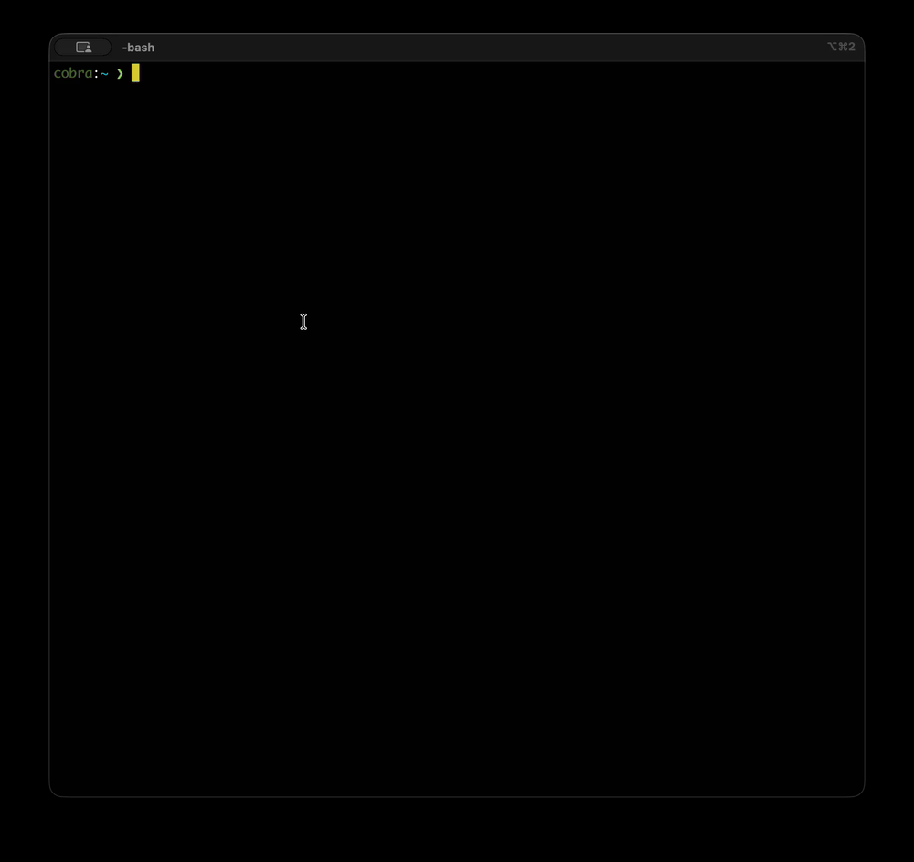

# cm (container multiplexer)

Manage multiple Docker containers (hundreds of them, if you want) with SSH access and simple tmux integration. Each instance gets its own SSH port and persistent workspace directory.

## Quick Start

After setup and image build:

```bash
cm start 1        # Start one container
cm ssh 1          # SSH into it
cm stop 1         # Stop it; the container and workspace remain
```

```bash
cm start 1-12     # Start instances 001-012
cm pan 1-6        # Open tmux panes, each SSH'd to a running instance
cm sync on        # Enable synchronize-panes for cm tmux sessions
```



## Setup

Verify Docker is installed and running:

```bash
docker info
```

If `docker info` works through a Docker CLI context but `cm` cannot connect, set `DOCKER_HOST` to that context's Docker endpoint, for example `unix://$HOME/.colima/default/docker.sock`.

Install `tmux` and Python 3.9+:

```bash
sudo apt install tmux python3 python3-venv
```

Or:

```bash
brew install tmux python
```

Create a dedicated SSH key:

```bash
ssh-keygen -t ed25519 -f ~/.ssh/cm_ed25519
chmod 400 ~/.ssh/cm_ed25519
```

Install `cm`:

```bash
./install.sh
```

The installer prompts for an install directory (`~/.local/bin` by default), creates `~/.cm/authorized_keys` from `~/.ssh/cm_ed25519.pub` if needed, creates `~/.cm/workspaces`, creates a private `.cm-venv` with the Python Docker SDK, copies the CLI as `cm.py`, and writes a `cm` wrapper.

Once installed, follow the [Images](#images) section below. Then you can jump to the [Commands](#commands) section to get started.

## Images

`cm start` needs a local Docker image named `cm` (`cm:latest`) when it creates a new container. Build the reusable base image first, then build the thin runtime image that adds the `cm` entrypoint:

```text
cm-base:latest            ->     cm:latest
customized base image            runtime entrypoint
```

### Image Build

Use this method for first-time setup and normal rebuilds:

```bash
docker build -t cm-base:latest -f Dockerfile.base .
docker build -t cm:latest .
```

When you want a fresh base from Debian packages, or after changing `Dockerfile.base`, rebuild the base without Docker's package-layer cache:

```bash
docker build --pull --no-cache -t cm-base:latest -f Dockerfile.base .
docker build -t cm:latest .
```

After changing only `Dockerfile` or `entrypoint.sh`, rebuild just the runtime image:

```bash
docker build -t cm:latest .
```

### Base Customization

Once `cm-base:latest` exists, you can customize it interactively and then rebuild the thin runtime image. This avoids re-running the slower Debian/package build for every ad-hoc base change.

Start a temporary container from the current base image:

```bash
docker run -it --user me --name cm-mod cm-base:latest /bin/bash
```

Make the changes inside that shell. For example:

```bash
sudo apt update && sudo apt install -y <package>
```

Exit the shell, then commit the container back over `cm-base:latest` and remove the temporary container:

```bash
docker commit cm-mod cm-base:latest && docker rm cm-mod
```

Rebuild `cm` so new instances use the updated base:

```bash
docker build -t cm:latest .
```

### Advanced Base Capture

If the useful change already exists in a running `cm` instance, you can commit that instance back to `cm-base:latest`.

Warning: committing a running instance can persist unwanted artifacts into `cm-base:latest`, including shell history, caches, logs, SSH state, UID/GID changes, and files outside the workspace. Before committing, inspect the instance and remove anything that should not become part of the reusable base image:

```bash
docker diff cm-001
docker exec -it cm-001 /bin/bash
```

Reset the runtime entrypoint while saving it as the base image:

```bash
docker commit --change 'ENTRYPOINT []' cm-001 cm-base:latest
docker build -t cm:latest .
```

### Apple Silicon

On Apple Silicon Macs, Docker builds native `linux/arm64` images by default. That avoids Intel/AMD64 emulation, so local builds and containers are usually faster, and the commands above work as-is.

If you specifically need Intel/AMD64 images, use `--platform linux/amd64` consistently:

```bash
docker build --platform linux/amd64 --pull --no-cache -t cm-base:latest -f Dockerfile.base .
docker build --platform linux/amd64 -t cm:latest .
```

If you customize the base interactively, start the temporary container with the same platform:

```bash
docker run --platform linux/amd64 -it --user me --name cm-mod cm-base:latest /bin/bash
docker commit cm-mod cm-base:latest && docker rm cm-mod
docker build --platform linux/amd64 -t cm:latest .
```

### Applying Image Changes

Image changes apply only to newly created containers. To move an instance to the new image, run `cm update N`; it recreates the container from the current local `cm:latest` image and preserves the workspace. The manual equivalent is to stop it, remove the stopped container with `cm rm N`, then start it again. The workspace remains unless you run `cm clean` while no container exists for that instance.

Use `cm list` to see whether each instance is using the current local `cm:latest` image. The `Image` column shows `current`, `stale`, or `unknown`; `cm inspect N` prints the container and local image IDs plus creation dates when Docker can read them.

## SSH Keys

`cm` expects a non-empty `~/.cm/authorized_keys` file. The installer creates it from `~/.ssh/cm_ed25519.pub` if needed. Running `./cm.py` from this checkout and running an installed `cm` both use the same file.

`cm` mounts that file into each container and tells the entrypoint where to find it via the `CM_AUTHORIZED_KEYS_SRC` environment variable (default: `/tmp/cm_authorized_keys`); `entrypoint.sh` then installs it as `/home/me/.ssh/authorized_keys`. If you run the image by hand, either mount your key file at that default path or set `CM_AUTHORIZED_KEYS_SRC` to wherever you mounted it.
`cm start` and `cm restart` abort before starting containers if the source file is missing, empty, or unreadable.

`cm ssh N` connects as `me@127.0.0.1` on the instance's published SSH port using `~/.ssh/cm_ed25519` by default. You do not need to create a `Host cm` entry in your SSH config. To force a different private key, use:

```bash
cm ssh -i ~/.ssh/other_key 1
```

## Linux UID/GID and Workspaces

Each workspace is a host directory under `~/.cm/workspaces/` bind-mounted at `/home/me/workspace`. On native Linux, new containers are created with your current host UID/GID in `CM_HOST_UID` and `CM_HOST_GID`; the entrypoint remaps the container user `me` before SSH starts. This keeps the bind-mounted workspace writable even when your host UID is not `1000`.

Do not run `cm start` or `cm restart` with `sudo` or as root on native Linux. The CLI rejects that case before creating the workspace because root-owned workspace directories can look like a successful start but be unwritable as `me` inside the container. Run `cm` as your normal user, usually by granting that user Docker access.

If a workspace was already created with the wrong owner, fix it from the host:

```bash
sudo chown -R "$USER:$USER" ~/.cm
```

If an existing stopped container was created for a different Linux UID/GID, `cm start` asks you to remove and recreate the container. The workspace remains when you run `cm rm N`, so the normal repair flow is:

```bash
cm stop N  # only if it is running
cm rm N
cm start N
```

Docker Desktop on macOS keeps the previous behavior; `cm` does not remap `me` there.

## Shell Completion

`cm autocomplete` currently prints bash completion only, and it depends on `bash-completion`. zsh completion is not implemented.

Install `bash-completion` if needed:

```bash
sudo apt install bash-completion
```

Or:

```bash
brew install bash-completion@2
```

Add this to your bash startup file, assuming you have used the `cm` installer. On Linux this is usually `~/.bashrc`; for bash login shells on macOS it may be `~/.bash_profile`.

```bash
command -v cm &>/dev/null && source <(cm autocomplete)
```

## Commands

Use `cm <command> -h` for command-specific help. 

Commands that accept instance lists (`start`, `stop`, `restart`, `update`, `rm`, `pan`, and `win`) support single numbers, ranges like `1-5`, and repeated values like `1 3 5`.

`stop`, `restart`, `update`, and `rm` also accept `all`. `ssh` and `logs` accept one instance number.

```bash
# Start/stop        (containers persist when stopped, like docker)
cm start 1          # Start instance (creates new or starts existing stopped container)
cm start 1-50       # Start 50 container instances (!)
cm stop 1           # Stop a container (keeps it for later restart)
cm stop all         # Stop all running instances
cm restart all      # Restart all running instances
cm update 1         # Recreate a stale instance from current cm:latest
cm update all       # Recreate stale instances from current cm:latest
cm rm 1             # Remove a non-running container
cm rm all           # Remove all non-running containers
cm clean            # Prompt to remove orphaned workspace directories

# Connect
cm list             # List instances with status, image status, health, port, and SSH command
cm ssh 1            # SSH into an individual instance
cm logs 1           # Stream container logs like "docker logs -f"
cm inspect 1        # Diagnose SSH, health, workspace, image drift, and UID/GID issues

# Tmux sessions     (for working with many container instances)
cm pan 1-9          # Use split panes, each SSH'd to a running instance
cm pan 1-9 --sync   # Same, with synchronize-panes enabled
cm win 1-2          # Use tmux windows instead of panes; sync is pane-only
cm kill             # Kill cm tmux sessions (all by default, with confirmation)
cm sync on          # Enable synchronize-panes for cm tmux sessions

# Shell
cm autocomplete     # Print the bash completion script

# Version
cm version          # Print version
```

More examples:

```bash
cm start 1 3 5      # Start a specific set of instances
cm stop 1-12        # Stop a range of running instances
cm restart 7        # Restart one instance
cm update 7 --yes   # Recreate without prompting
cm update 7 -y      # Short form of --yes
cm update 7 --force # Recreate even when image status is current or unknown
cm rm 1-12          # Remove a range of non-running containers
cm inspect 1 --logs 50 --verbose  # Diagnose with recent logs and extra detail
cm inspect 1 --no-exec            # Diagnose without running commands in the container
cm pan 1-9 -s       # Short form of --sync
cm sync off         # Disable synchronize-panes for cm tmux sessions
cm kill cm-s1       # Kill one named cm tmux session
cm sync off cm-s1   # Disable synchronize-panes for one named cm tmux session
```

## Behavior Notes

- Instance numbers must be between 1 and 499.
- Multi-instance `start`, `stop`, `restart`, `update`, and `rm` operations run in parallel.
- `cm restart N` starts instance N, creating it if it does not exist, while `cm restart all` only restarts currently running instances.
- Instances do not auto-start on host boot; run `cm start` again after a reboot.
- SSH ports bind to `127.0.0.1` and default to `2200 + N`, but `cm` tries up to 100 consecutive ports when a port is busy before giving up. Use `cm list` instead of assuming the port.
- `cm list` compares each container image ID to the current local `cm:latest` image ID and reports `current`, `stale`, or `unknown`.
- `cm update` recreates containers from `cm:latest`. It preserves the workspace bind mount, but changes inside the container outside `/home/me/workspace` are lost.
- Workspaces live under `~/.cm/workspaces/` (`~/.cm/workspaces/cm.001/`, `~/.cm/workspaces/cm.002/`, and so on) and are mounted at `/home/me/workspace`.
- `cm clean` only considers workspace directories named exactly `cm.001` through `cm.499` that have no matching container; anything else under `~/.cm/workspaces/` is ignored.
- On native Linux, code running inside a container can write files as any uid (including root-owned setuid binaries) into its `~/.cm/workspaces/cm.NNN/` directory, so do not execute workspace artifacts you do not trust. Docker userns-remap provides stronger isolation.
- Tmux sessions are named `cm-s1`, `cm-s2`, and so on.
- Clean exit from a container shell closes the tmux pane. Connection errors drop to a host shell.
- When launched from an existing tmux or byobu session, `cm pan` and `cm win` switch the current tmux client into the new session; when that session is destroyed, tmux stays attached to another available session instead of detaching.
